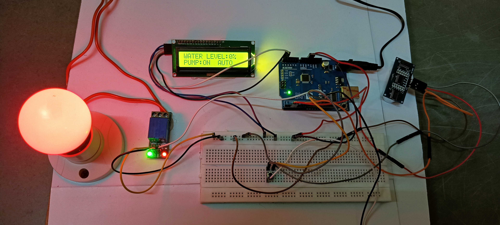

# Automatic Water Control Pump using Arduino

This project aims to automate the water control system using an Arduino board, an ultrasonic sensor, and a relay module. The system detects the water level and activates the pump accordingly. This Readme file provides an overview of the project, its components, and instructions for setting it up.

## Components Required
- Arduino UNO
- LCD & I2C Module
- Ultrasonic Sensor
- Relay Module (1 channel)
- ON/OFF Switch
- Mini Push Button
- Jumper Wire
- Breadboard
- Power Adaptor for Arduino (12V, 2A)
- USB A to USB B Cable for Arduino UNO 
- 0 - Watt Buld 
- Copper wire
- Bulb Holder
- 2 Pin Plug

## Circuit Diagram

## Installation and Setup
1. Solder the I2C Module with the LCD Display, ensuring that the pins do not touch each other.
2. Solder the ON/OFF Switch with two male-to-male jumper wires.
3. Connect the 5V port of the Arduino to one line of the breadboard, making the entire line 5V.
4. Connect the GND port of the Arduino to another line of the breadboard, making the entire line ground.
5. Connect GND and VCC of the I2C Module (soldered with LCD Display) to the respective lines on the breadboard.
6. Connect SDA and SCL of the I2C Module to the A4 and A5 pins on the Arduino.
7. Connect VCC and GND of the Ultrasonic Sensor to the respective lines on the breadboard.
8. Connect Trig and Echo of the Ultrasonic Sensor to pins 2 and 3 on the Arduino.
9. Connect VCC and GND of the Relay Module to the respective lines on the breadboard.
10. Connect IN of the Relay Module to pin 13 on the Arduino.
11. Connect a mini push button in between 5 columns of the breadboard.
12. Connect one pin of the mini push button to GND of the Arduino, and another pin to pin 10 of the Arduino.
13. Connect one pin of the ON/OFF button to the third pin of the mini push button, and the other pin to pin 11 of the Arduino.
14. Set up the bulb holder and connect one wire of the holder to a fan connector.
15. Connect the other wire of the holder to the NO pin of the Relay Module.
16. Connect COM of the Relay Module to another pin of the connector using copper wire.
17. Extend the copper wire via a connector and connect a two-pin plug for AC power input.
18. Connect the Arduino to a laptop/PC using a USB A to USB B cable.
19. Install the Arduino IDE software.
20. Make sure to select the correct board (Arduino UNO) and port in the Arduino IDE, then upload the code to the Arduino.
21. Once uploaded, disconnect the USB cable.
22. Connect the 12V port of the Arduino to a 220V AC power source using a 12V AC adapter and a 2-pin plug.
23. The LCD display will show the water level percentage.
24. Observe the changes in the water level percentage by varying the ultrasonic sensor's position.

## Uploading the Code
1. Install the Arduino IDE from the official website (https://www.arduino.cc/en/software).
2. Open the Arduino IDE and create a new sketch.
3. Copy the code from the `Water_Level_2.ino` file in this repository.
4. Paste the code into the Arduino IDE.
5. Verify and compile the code to check for any errors.
6. Once the code is successfully compiled, upload it to the Arduino board.

## Usage
1. Make sure the water pump, Arduino board, and power supply are properly connected.
2. Place the ultrasonic sensor at an appropriate location to detect the water level.
3. Power on the Arduino board.
4. The system will start detecting the water level using the ultrasonic sensor.
5. If the water level is below a certain threshold, the relay module will activate the water pump.
6. If the water level rises above the threshold, the relay module will deactivate the water pump.
7. The pump will automatically turn on/off based on the detected water level.

## Contributing
Contributions are welcome! If you find any issues or want to enhance this project, please submit a pull request.

## License
This project is licensed. Feel free to modify and use it for your own purposes.

## Acknowledgments
- Thanks to the open-source community for providing the necessary libraries and resources for Arduino programming.
- Inspired by similar projects and ideas available online.
